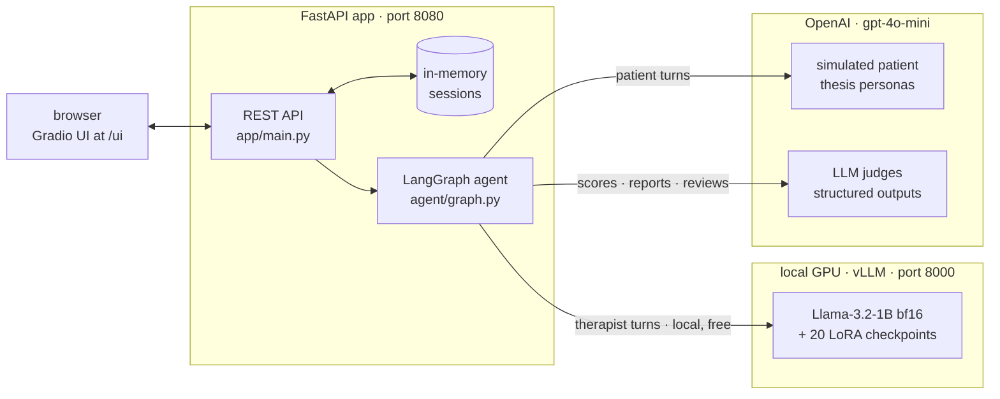
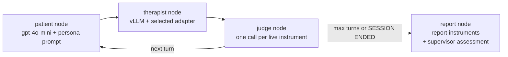
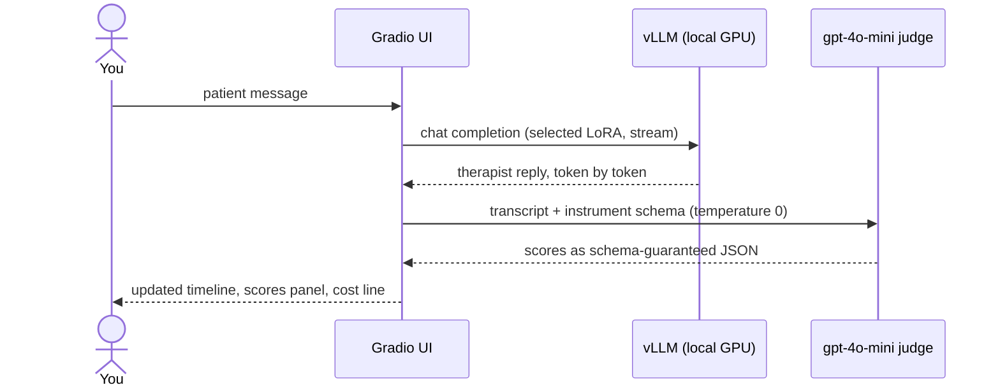

<div align="center">

# MI Coach

**Practice Motivational Interviewing against a thesis-tuned 1B therapist — every turn scored live by LLM judges.**


*MI Coach is a **practice tool for MI skills** aimed at trainees and researchers.
It is **not therapy** and must not be used as a substitute for professional mental-health care.*

</div>


<sup>**Auto-demo, one click, everything streaming:** a gpt-4o-mini patient (thesis persona)
talks to the PTO-tuned Llama-3.2-1B therapist; the Q1 judge scores each turn onto the live
timeline; the session ends with a multi-instrument report and a ★-rated supervisor assessment.</sup>

## What is this?

My M.Sc. thesis (ICLR 2025 workshop paper) compared **PTO vs GRPO post-training** of small
therapist LLMs for Motivational Interviewing — a counseling style built on open questions,
reflections, and rolling with resistance rather than confrontation. The thesis produced
LoRA checkpoints and an LLM-judge evaluation stack; **MI Coach turns them into a real,
deployed, benchmarked service**:

- **A serving layer** — base Llama-3.2-1B + all 20 training checkpoints of both methods on
  one local GPU via [vLLM](https://github.com/vllm-project/vllm), switchable per request
  ([benchmark](#-performance-vllm-vs-hf-transformers): up to ~20× HF Transformers throughput).
- **An agent layer** — a [LangGraph](https://github.com/langchain-ai/langgraph) loop wires
  the local therapist to a simulated patient and to **LLM-as-a-judge scoring** with the
  thesis questionnaires ([how it works](#-how-it-works)).
- **A practice app** — FastAPI + Gradio: play either side of the session, watch live
  scores, A/B-compare checkpoints, define your own judge instruments, and export
  everything ([tour](#-tour)).
- **An evaluation harness** — the thesis experiment shape re-run *in the deployed system*,
  reproducing the thesis' best-checkpoint picks ([results](#-does-the-deployed-model-match-the-thesis)).

The parts talk to each other like this:



## 🎬 Tour

### Play the therapist — the judges score *you*

That's the "coach" in MI Coach: switch roles and **you** write the therapist lines. A
simulated patient (thesis persona — problem, age, cooperation level, all configurable)
responds, the judge scores *your* MI skills turn by turn, and the final report tells you
your strengths, growth areas, and one concrete tip:


### Compare checkpoints A/B

Send the same patient message to two checkpoints, or auto-demo both against the *same*
persona — concurrently, both sides streaming. Each side gets its own score timeline and
report; the **⚖️ comparative review** is one judge call that reads both transcripts and
returns a structured verdict (preferred model, key behavioral differences, per-side
strengths, recommendation):


### Build your own judge instrument

The eight thesis questionnaires are not special-cased: define a name + statements (each
rated 1–5 over the transcript, exactly like the thesis instruments) and your instrument
appears in every judge list, plots dashed on the timeline, and persists across restarts:


### History & export

Every session of a server run — practice, compare, auto-demo — with transcript, scores,
report, comparison verdict, markdown export, and its **actual OpenAI cost** (the whole
table below cost ~2 cents):


## 🧠 How it works

### The agent loop

The core is a small LangGraph state machine (`agent/graph.py`). An auto-demo run is one
invocation of this graph; interactive play invokes the sub-paths per turn:



- **therapist node** — one chat completion against local vLLM with the selected LoRA
  adapter, the thesis system prompt, and the ChatML stop strings.
- **patient node** — gpt-4o-mini under a thesis persona prompt. It sees the conversation
  *role-flipped* (from the patient-sim's point of view, *it* is the assistant).
- **judge node** — scores the running transcript with each selected per-turn instrument.
- **report node** — scores the full transcript with the report instruments, then one more
  call — the **supervisor assessment** — reads the transcript *and* the judges' numbers and
  returns `{overall_rating, summary, strengths, growth_areas, tip}`.

An interactive turn streams, and streaming can't cross a compiled LangGraph node — so the
UI follows a deliberate **stream-then-judge** pattern:



### The judges

Judging reuses the thesis evaluation stack verbatim (`assets/thesis/questionnaires.py`).
One judge call = one instrument scored over the full transcript so far, via OpenAI
**structured outputs** against the thesis JSON schemas — the reply is guaranteed to parse,
there is no free-text score scraping. Instruments are selected independently for the live
per-turn judge and the end-of-session report:

| Instrument | What the judge rates | Default |
|---|---|---|
| **Q1** | Patient satisfaction, 5 items *(thesis primary)* | live, every turn |
| **Q2** | Therapist behaviors, 17 items *(thesis primary)* | report |
| **MITI** | MI Treatment Integrity: 4 global scores + 7 behavior counts | report |
| **WAI-SR** | Working Alliance Inventory (short) | — |
| **CSQ-8** | Client Satisfaction Questionnaire | — |
| **MI-SAT** | MI intervention satisfaction | — |
| **PCT** | Patient change talk / readiness | — |
| **MICI** | MI-inconsistent behaviors (lower is better) | — |
| ***custom*** | your own statements, rated 1–5 like the rest | — |

Each judge call can optionally attach a **one-sentence rationale per instrument**
(separate toggles for per-turn and report judging) — the rationale field is added by
copying the thesis schema at call time, never by editing thesis code. Judges run at
temperature 0; an optional seed additionally pins therapist/patient sampling.

### What it costs

Cost is a first-class value: every OpenAI response's token usage flows into the session,
and the UI, exports, API responses, and eval all show real dollars. vLLM calls are local
and free. Real numbers from the History demo above: a scored 3-turn auto-demo with a full
report lands around **$0.002–0.004**; a single judged turn is ~$0.0003; the entire
24-session persona sweep below cost **$0.05**.

## 📊 Does the deployed model match the thesis?

Every checkpoint of both methods was evaluated **in the deployed system** with
`eval/run_eval.py`: 3 auto-demo sessions per checkpoint (fixed thesis patient persona),
scored per turn with Q1 and at session end with Q2 + MITI (gpt-4o-mini judge):


Both post-training methods clearly improve over the base model, and the checkpoints this
evaluation ranks best — **PTO iteration 10** and **GRPO iteration 8** — are exactly the
checkpoints the thesis evaluation selected:

| Checkpoint | Q1 (per-turn) | Q2 (17 items) | MITI globals |
|---|---|---|---|
| base Llama-3.2-1B | 2.58 ± 0.23 | 3.49 ± 0.78 | 3.08 ± 0.38 |
| PTO iter 10 (best) | 3.49 ± 0.30 | **4.43 ± 0.24** | **4.25 ± 0.43** |
| GRPO iter 8 (best) | **3.78 ± 0.14** | 4.29 ± 0.00 | **4.33 ± 0.29** |

Full per-iteration table in `eval/results/`. Honest caveats: the judge is an LLM, sessions
are short (3 patient turns) and sampled, and n=3 per checkpoint — error bars are wide.
This reproduces the *shape* of the thesis evaluation in the deployed system; it is not a
re-run of the thesis experiments.

### Robustness across patient personas

The best checkpoints were also swept over four thesis patient personas
(`eval/run_eval.py --personas all`): different problem (smoking/obesity), age, history,
and cooperation level — including a young resistant smoker who never tried quitting:


Both adapters beat the base model on **every persona and metric**; the hardest persona for
everyone is the resistant patient, the easiest the eager one — the expected ordering. Full
table in `eval/results/eval-personas-latest.md`.

## 🚀 Performance: vLLM vs HF Transformers

```bash
# terminal 1
bash scripts/serve.sh
# terminal 2
.venv/bin/python bench/run_bench.py            # vLLM (sequential + concurrent x8)
# then stop the server and, for a clean VRAM reading:
.venv/bin/python bench/run_bench.py --skip-vllm  # HF Transformers baseline
```

Llama-3.2-1B (bf16) + thesis LoRA adapters, RTX 5070 Ti (12 GB), WSL2, 8 MI practice
prompts per config, 256 max new tokens, temperature 0.7 (2026-07-13):

| Config | Tokens/s | p50 latency (s) | p95 latency (s) | Peak VRAM (MiB) |
|---|---|---|---|---|
| HF Transformers + LoRA `pto-iter10` (sequential) | 46.0 | 3.70 | 5.12 | 2,450 |
| vLLM + LoRA `pto-iter10` (sequential) | 154.7 | 0.30 | 1.04 | 11,406¹ |
| vLLM + LoRA `pto-iter10` (concurrent ×8) | 657.8 | 0.37 | 1.30 | 11,406¹ |
| vLLM + LoRA `grpo-iter8` (sequential) | 147.6 | 0.79 | 1.69 | 11,406¹ |
| vLLM + LoRA `grpo-iter8` (concurrent ×8) | 911.1 | 0.89 | 1.79 | 11,406¹ |

**vLLM delivers ~3.4× single-stream throughput over HF Transformers, and up to ~20×
aggregate throughput with continuous batching** (911 vs 46 tokens/s).

¹ vLLM preallocates 85% of VRAM up front (weights + paged KV cache sized for ~58
concurrent 4k-token sequences); HF's number is the actual allocation for one sequence.
Latency columns are not directly comparable across engines — completions are sampled and
stop-string–terminated, so output lengths differ; tokens/s is the like-for-like metric.
Raw runs: `bench/results/` (regenerate with `bench/run_bench.py`).

## 🏁 Getting started

Requirements: Linux or WSL2, NVIDIA GPU (developed on an RTX 5070 Ti, 12 GB), Python 3.12,
[uv](https://docs.astral.sh/uv/), and a Hugging Face token with access to the gated
`meta-llama/Llama-3.2-1B-Instruct`.

```bash
uv venv --python 3.12 .venv
uv pip install --python .venv/bin/python -r requirements.txt \
  --extra-index-url https://flashinfer.ai/whl/cu130   # flashinfer-jit-cache (prebuilt kernels, no nvcc needed)
export HF_TOKEN=...   # keys via env vars only — never committed
```

vLLM additionally needs FFmpeg shared libraries (via `torchcodec`) and a C compiler
(Triton/Inductor JIT). Either `sudo apt install ffmpeg build-essential`, or — no sudo
needed — run the bundled fallback once (FFmpeg libs from the PyAV wheel, `zig cc` from
the ziglang wheel; `serve.sh` picks both up automatically):

```bash
bash scripts/setup_local_toolchain.sh
```

Place the thesis LoRA adapters under `assets/adapters/` — `pto-iter10/` (default) and
optionally `grpo-iter8/`. Adapter weights are not committed; see `assets/README.md`.

### Serve the model

```bash
bash scripts/serve.sh
```

Starts vLLM on `http://localhost:8000/v1`. Each adapter under `assets/adapters/` is
exposed as its own model (`mi-coach-<method>-iter<N>`); run
`bash scripts/link_adapters.sh` once to link **every training iteration of both methods**
(PTO 1-10, GRPO 1-10 — thesis-best: **PTO iter 10**, **GRPO iter 8**), so you can compare
any checkpoint per request via the `model` field. The base model stays available under its
Hugging Face id. LoRA swapping is cheap: vLLM keeps 4 adapters on GPU and LRU-caches the
rest in RAM.

<details>
<summary><b>Query the raw endpoint (curl)</b> — note the ChatML quirk explained below</summary>

The adapters were trained on base `meta-llama/Llama-3.2-1B` with the therapist system
prompt in `assets/therapist_system_prompt.txt` and a ChatML template whose markers are
plain text — pass them as `stop` strings:

```bash
curl http://localhost:8000/v1/chat/completions -H "Content-Type: application/json" -d @- <<'EOF'
{
  "model": "mi-coach-pto-iter10",
  "messages": [
    {"role": "system", "content": "You are a motivational interviewing counselor named David. You partner with the patient to understand his problems. You are empathetic towards him and help the patient explore their ambivalence regarding behavioral change. You are non-judgmental while encouraging the patient to change. In your answer, please avoid repetitions and unnecessary loops in the conversation. In your answer, please avoid repeating expressions of gratitude or similar sentiments multiple times if you've already expressed them during the conversation. You should only end the session when at least one of the following conditions is met. If you need to end the session, write \"SESSION ENDED\" followed by the condition number: 1. If you believe that you have provided the appropriate treatment to the patient and have nothing else to advise in the current session.2. When time is up."},
    {"role": "assistant", "content": "Hello, welcome to your first motivational session with me. My name is David and I`m a professional motivational counselor. Can you start by telling me a little bit about yourself and why are you here?"},
    {"role": "user", "content": "Hi David. I have smoked for years and I know I should stop, but it is the only thing that helps me unwind."}
  ],
  "max_tokens": 200,
  "stop": ["<|im_end|>", "<|im_start|>"]
}
EOF
```

(The system prompt is the thesis expert-therapist prompt, also in
`assets/therapist_system_prompt.txt`.)

</details>

### Run the practice app

With the vLLM server running:

```bash
.venv/bin/python -m uvicorn app.main:app --host 0.0.0.0 --port 8080
```

UI at http://localhost:8080/ui, OpenAPI docs at `/docs`. Set `OPENAI_API_KEY` (e.g. in
`.env`) to enable the simulated patient and judging; without it the app degrades to plain
chat against the local model. **Advanced settings** apply across all tabs:
therapist/patient temperatures, max tokens, judge model, sampling seed, auto-demo length
(up to 20 patient turns), rationale toggles.

### Docker

The app has its own image; vLLM runs from the official `vllm/vllm-openai` image with the
adapters mounted read-only. Requires the
[NVIDIA Container Toolkit](https://docs.nvidia.com/datacenter/cloud-native/container-toolkit/latest/install-guide.html):

```bash
MODEL_ID=meta-llama/Llama-3.2-1B HF_TOKEN=... docker compose up --build
# UI on http://localhost:8080/ui, raw vLLM endpoint on http://localhost:8000/v1
```

## 🔌 HTTP API

Everything the UI does is also a REST call (interactive docs at `/docs`):

| Endpoint | What it does |
|---|---|
| `POST /sessions` | create a session: model, your role, persona, questionnaires, generation `params`, rationale flags |
| `POST /sessions/{id}/message` | send a turn → reply, per-turn judge scores, cumulative usage/cost |
| `POST /sessions/{id}/report` | end-of-session report (generated once, cached on the session) |
| `POST /demo` | run a full simulated session (stored — shows up in history) |
| `POST /compare/review` | comparative verdict between two sessions |
| `GET /sessions` · `GET /sessions/{id}` | list session summaries / fetch one |
| `GET /sessions/{id}/export` | the whole session as markdown |
| `DELETE /sessions/{id}` | drop a session |
| `GET`/`POST`/`DELETE /questionnaires` | manage custom judge instruments |
| `GET /health` | liveness, served models, whether live scoring is on |

Sessions are in-memory by design — this is a practice tool, not a clinical record store.

## 🗺️ Code map

```
MI-Coach/
├── agent/                    # THE BRAIN, layered bottom-up:
│   ├── config.py             #   env + .env, params, pricing/usage, the two API clients
│   ├── thesis.py             #   bridge to the copied thesis assets (prompts, personas, transcript)
│   ├── judging.py            #   questionnaire registry, custom instruments, structured judge calls
│   └── graph.py              #   LangGraph nodes, compiled graphs, streaming, run_* entry points
├── app/
│   ├── main.py               #   Pydantic request models + REST routes + /ui mount
│   ├── sessions.py           #   Session model, in-memory store, session lifecycle
│   ├── rendering.py          #   markdown renderers + the score-timeline plot
│   └── ui/                   #   Gradio: shared.py + practice.py + compare.py + history.py
├── assets/
│   ├── therapist_system_prompt.txt   # the thesis expert-therapist prompt
│   ├── thesis/               #   copied thesis judge rubrics + persona builder (read-only)
│   └── adapters/             #   LoRA checkpoint symlinks (gitignored)
├── bench/run_bench.py        # Phase-1 throughput benchmark (vLLM vs HF)
├── eval/run_eval.py          # offline eval harness (iterations + personas)
├── scripts/serve.sh          # vLLM launcher (base model + all 20 checkpoints)
├── tests/                    # characterization suite (pytest; every model call faked)
└── docs/CODE_TOUR.md         # the full guided walkthrough
```

The session dict is the app's unit of state; its shape doubles as the API contract
(`report`/`comparison` are *absent until produced* — presence is the contract):

```python
{id, created_at, kind,          # kind: practice | compare | demo
 model, role,                   # role = which side the HUMAN plays
 messages, patient_persona,     # patient = "user", therapist = "assistant"
 turn_scores, turn_questionnaires, report_questionnaires,
 params, turn_rationale, report_rationale,
 usage,                         # cumulative OpenAI usage/cost
 report?, comparison?}          # ABSENT until produced
```

Design decisions worth knowing (the full "why" list is in
[docs/CODE_TOUR.md](docs/CODE_TOUR.md)):

- **Thesis code is untouched.** Extensions (rationale field, persona enums) wrap or copy
  at call time, so the copied files stay diffable against the thesis originals.
- **Structured outputs everywhere** a model returns data — parsing is deterministic; a
  schema mismatch fails loudly instead of silently mis-scoring.
- **Streaming bypasses LangGraph by design**: stream the reply, then judge. Non-streaming
  callers (the REST API) use the full compiled graphs.
- **An empty questionnaire list means "judging off"** (an explicit user choice, and zero
  judge cost); an *omitted* list means defaults. The distinction is kept everywhere.
- **ChatML markers are plain text** to this tokenizer — every completion passes
  `stop=["<|im_end|>", "<|im_start|>"]`, and `clean_reply()` regex-cuts malformed
  markers the stop strings can't catch.

### Tests

A characterization suite pins the API contract, judging, cost accounting, the markdown
export, and the UI streaming engine. **No network, no GPU**: every model call is answered
by a fake whose JSON-schema walker satisfies all judge schemas (thesis, custom, rationale
variants alike), so the suite runs anywhere in seconds:

```bash
uv pip install --python .venv/bin/python -r requirements-dev.txt
.venv/bin/python -m pytest        # 35 tests, < 15s
```

## 🎓 Provenance

The LoRA adapters, judge questionnaires, patient personas, and the therapist system prompt
come from the thesis *"PTO vs GRPO post-training of small therapist LLMs for Motivational
Interviewing"* (M.Sc. thesis; ICLR 2025 workshop paper). Thesis files are copied into
`assets/` with origin headers and treated as read-only; adapter weights are not part of
the repo. All demo GIFs above are real recordings of the running system.
