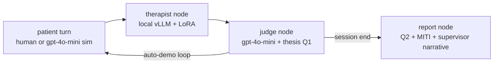

# MI Coach

A training-and-practice tool for **Motivational Interviewing (MI)** skills: a fine-tuned
Llama-3.2-1B therapist model (from my M.Sc. thesis on PTO vs GRPO post-training, ICLR 2025
workshop paper) served as a real, benchmarked service.

> **Disclaimer:** MI Coach is a *practice tool for MI skills* aimed at trainees and
> researchers. It is **not therapy** and must not be used as a substitute for professional
> mental-health care.

## Status — Phase 3: LangGraph agent layer

- **Phase 1 (done):** Llama-3.2-1B + thesis LoRA adapters served via
  [vLLM](https://github.com/vllm-project/vllm) (OpenAI-compatible endpoint), benchmarked
  against plain HF Transformers (results below).
- **Phase 2 (done):** FastAPI session API + Gradio practice UI (you play the patient),
  Dockerfile + compose.
- **Phase 3 (this):** [LangGraph](https://github.com/langchain-ai/langgraph) agent —
  every therapist turn is scored live by an LLM-as-a-Judge (gpt-4o-mini + the thesis
  questionnaires), sessions end with an MI feedback report, and an auto-demo mode runs
  a simulated patient.


## Agent layer



Judging uses the thesis evaluation stack (`assets/thesis/questionnaires.py`): per-turn
**Q1** (5-item satisfaction), and at session end **Q2** (17 items) plus **MITI**
(MI Treatment Integrity globals + behavior counts), all via OpenAI structured outputs
against the thesis JSON schemas — no free-text parsing. The simulated patient uses the
thesis persona prompts (`assets/thesis/system_prompts_builder.py`). All judge/patient
calls are gpt-4o-mini; a full scored demo session costs about a cent.

## Setup

Requirements: Linux or WSL2, NVIDIA GPU (developed on an RTX 5070 Ti, 12 GB), Python 3.12,
[uv](https://docs.astral.sh/uv/), and a Hugging Face token with access to the gated
`meta-llama/Llama-3.2-1B-Instruct`.

```bash
uv venv --python 3.12 .venv
uv pip install --python .venv/bin/python -r requirements.txt \
  --extra-index-url https://flashinfer.ai/whl/cu130   # flashinfer-jit-cache (prebuilt kernels, no nvcc needed)
export HF_TOKEN=...   # keys via env vars only — never committed
```

vLLM additionally needs FFmpeg shared libraries (via `torchcodec`) and a C compiler
(Triton/Inductor JIT). Either `sudo apt install ffmpeg build-essential`, or — no sudo
needed — run the bundled fallback once (FFmpeg libs from the PyAV wheel, `zig cc` from
the ziglang wheel; `serve.sh` picks both up automatically):

```bash
bash scripts/setup_local_toolchain.sh
```

Place the thesis LoRA adapters under `assets/adapters/` — `pto-iter10/` (default) and
optionally `grpo-iter8/`. Adapter weights are not committed; see `assets/README.md`.

## Serve

```bash
bash scripts/serve.sh
```

Starts vLLM on `http://localhost:8000/v1`. Each adapter under `assets/adapters/` is
exposed as its own model — `mi-coach-pto-iter10` (thesis default) and
`mi-coach-grpo-iter8` — so you choose the adapter per request via the `model` field;
the base model stays available under its Hugging Face id.

The adapters were trained on base `meta-llama/Llama-3.2-1B` with the therapist system
prompt in `assets/therapist_system_prompt.txt` and a ChatML template whose markers are
plain text — pass them as `stop` strings:

```bash
curl http://localhost:8000/v1/chat/completions -H "Content-Type: application/json" -d @- <<'EOF'
{
  "model": "mi-coach-pto-iter10",
  "messages": [
    {"role": "system", "content": "You are a motivational interviewing counselor named David. You partner with the patient to understand his problems. You are empathetic towards him and help the patient explore their ambivalence regarding behavioral change. You are non-judgmental while encouraging the patient to change. In your answer, please avoid repetitions and unnecessary loops in the conversation. In your answer, please avoid repeating expressions of gratitude or similar sentiments multiple times if you've already expressed them during the conversation. You should only end the session when at least one of the following conditions is met. If you need to end the session, write \"SESSION ENDED\" followed by the condition number: 1. If you believe that you have provided the appropriate treatment to the patient and have nothing else to advise in the current session.2. When time is up."},
    {"role": "assistant", "content": "Hello, welcome to your first motivational session with me. My name is David and I`m a professional motivational counselor. Can you start by telling me a little bit about yourself and why are you here?"},
    {"role": "user", "content": "Hi David. I have smoked for years and I know I should stop, but it is the only thing that helps me unwind."}
  ],
  "max_tokens": 200,
  "stop": ["<|im_end|>", "<|im_start|>"]
}
EOF
```

(The system prompt is the thesis expert-therapist prompt, also in
`assets/therapist_system_prompt.txt`.)

## Practice app (FastAPI + Gradio)

With the vLLM server running:

```bash
.venv/bin/python -m uvicorn app.main:app --host 0.0.0.0 --port 8080
```

- **UI:** http://localhost:8080/ui — pick the adapter, chat as the patient, watch the
  live score panel; *End session → report* for the full MI feedback report;
  *Auto-demo* to watch a simulated patient session.
- **API:** `POST /sessions` (choose model) → `POST /sessions/{id}/message` (returns the
  therapist reply + per-turn judge score) → `POST /sessions/{id}/report`;
  `POST /demo` runs a full simulated session. OpenAPI docs at `/docs`; `GET /health`.
  Sessions are in-memory (practice tool, not a clinical record store).
- Set `OPENAI_API_KEY` (e.g. in `.env`) to enable judging; without it the app degrades
  to plain chat.

## Docker

The app has its own image; vLLM runs from the official `vllm/vllm-openai` image with
the adapters mounted read-only. Requires the
[NVIDIA Container Toolkit](https://docs.nvidia.com/datacenter/cloud-native/container-toolkit/latest/install-guide.html):

```bash
MODEL_ID=meta-llama/Llama-3.2-1B HF_TOKEN=... docker compose up --build
# UI on http://localhost:8080/ui, raw vLLM endpoint on http://localhost:8000/v1
```

## Benchmark

```bash
# terminal 1
bash scripts/serve.sh
# terminal 2
.venv/bin/python bench/run_bench.py            # vLLM (sequential + concurrent x8)
# then stop the server and, for a clean VRAM reading:
.venv/bin/python bench/run_bench.py --skip-vllm  # HF Transformers baseline
```

### Results

Llama-3.2-1B (bf16) + thesis LoRA adapters, RTX 5070 Ti (12 GB), WSL2, 8 MI practice
prompts per config, 256 max new tokens, temperature 0.7 (2026-07-13):

| Config | Tokens/s | p50 latency (s) | p95 latency (s) | Peak VRAM (MiB) |
|---|---|---|---|---|
| HF Transformers + LoRA `pto-iter10` (sequential) | 46.0 | 3.70 | 5.12 | 2,450 |
| vLLM + LoRA `pto-iter10` (sequential) | 154.7 | 0.30 | 1.04 | 11,406¹ |
| vLLM + LoRA `pto-iter10` (concurrent ×8) | 657.8 | 0.37 | 1.30 | 11,406¹ |
| vLLM + LoRA `grpo-iter8` (sequential) | 147.6 | 0.79 | 1.69 | 11,406¹ |
| vLLM + LoRA `grpo-iter8` (concurrent ×8) | 911.1 | 0.89 | 1.79 | 11,406¹ |

**vLLM delivers ~3.4× single-stream throughput over HF Transformers, and up to ~20×
aggregate throughput with continuous batching** (911 vs 46 tokens/s).

¹ vLLM preallocates 85% of VRAM up front (weights + paged KV cache sized for ~58
concurrent 4k-token sequences); HF's number is the actual allocation for one sequence.
Latency columns are not directly comparable across engines — completions are sampled and
stop-string–terminated, so output lengths differ; tokens/s is the like-for-like metric.
Raw runs: `bench/results/` (regenerate with `bench/run_bench.py`).
